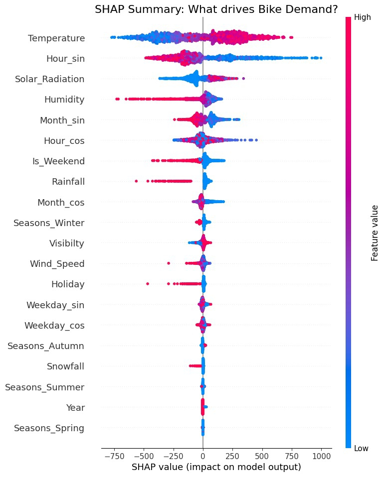
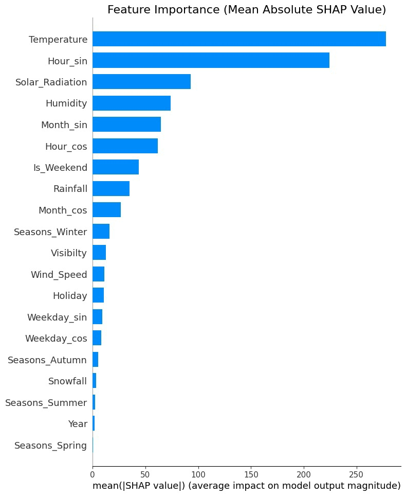

# 🚲 Urban Mobility Optimization: Predicting Bike Sharing Demand


## 📋 Executive Summary
This project builds a machine learning solution to optimize the logistics of a city-wide bike-sharing system. By predicting hourly demand with **93.5% accuracy ($R^2$)**, the model enables the operational team to move from **reactive** logistics (fixing empty stations) to **proactive** inventory management (preventing stockouts), potentially reducing lost revenue and improving user satisfaction.

**Champion Model:** LightGBM Regressor (Tuned)
**Key Techniques:** Cyclic Feature Encoding, Log-Transformation, SHAP Interpretability.

---

## 💼 The Business Problem
**Context:** Public bike-sharing systems suffer from the "rebalancing problem."
1.  **Rush Hour Stockouts:** Stations in residential areas empty out at 8 AM, while office stations overflow.
2.  **Revenue Loss:** If a user can't find a bike, the company loses money and trust.
3.  **Operational Cost:** Moving bikes randomly is expensive.

**Goal:** Predict the exact `Rented Bike Count` for any given hour in the future based on weather, time, and calendar data, allowing the logistics team to pre-stock high-demand stations.

---

## 🛠️ Tech Stack & Methodology

* **Language:** Python
* **Data Manipulation:** Pandas, NumPy
* **Visualization:** Seaborn, Matplotlib, Plotly (Interactive)
* **Machine Learning:** Scikit-Learn, XGBoost, LightGBM
* **Interpretability:** SHAP (SHapley Additive exPlanations)
* **Workflow:** Scikit-Learn Pipelines (to prevent data leakage)

### Key Engineering Steps:
1.  **Target Transformation:** Applied `Log1p` transformation to handle the right-skewed demand distribution.
2.  **Cyclic Feature Encoding:** Converted `Hour`, `Month`, and `Weekday` into Sine/Cosine components to preserve temporal relationships (e.g., 23:00 is close to 00:00).
3.  **Feature Selection:** Removed multicollinear features (e.g., `Dew_Point_Temp`) using Variance Inflation Factor (VIF) analysis.
4.  **Experimental Pipeline:** Compared 7 algorithms (Linear, Ridge, Lasso, Decision Tree, Random Forest, XGBoost, LightGBM).
5.  **Hyperparameter Tuning:** Optimized the top 3 models using `GridSearchCV` inside a Pipeline.

---

## 📊 Model Performance

After extensive testing, **LightGBM** emerged as the winner, balancing speed and accuracy.

| Model | Test $R^2$ Score | Train $R^2$ Score | Observation |
| :--- | :--- | :--- | :--- |
| **LightGBM (Tuned)** | **0.9353** | **0.9482** | **Best Performance / No Overfitting** |
| XGBoost (Tuned) | 0.9250 | 0.9410 | Strong Contender |
| Random Forest | 0.9200 | 0.9850 | Slight Overfitting |
| Linear Regression | 0.5500 | 0.5600 | Failed to capture non-linear patterns |

### Actual vs. Predicted Analysis
The model shows tight alignment with the ideal prediction line, with minor variance only during extreme outlier events (demand > 2500).

*(Place your 'Actual vs Predicted' plot here: Save it as `images/actual_vs_pred.png`)*
``

---

## 🔍 Key Insights & Interpretability (SHAP)

Using SHAP analysis, we uncovered the primary drivers of demand:

1.  **The "Commuter Heartbeat":** Demand is strictly bimodal. The strongest predictor is `Hour`, with sharp peaks at **8:00 AM** and **6:00 PM**.
2.  **The Goldilocks Temperature:** Demand rises with temperature but plateaus/drops above **25°C** (Too hot to ride).
3.  **Rain is a "Kill Switch":** Even minimal rainfall causes demand to plummet near zero, overriding all other factors.




---

## 🚀 Business Recommendations

Based on the model's findings, I recommend the following operational strategies:

1.  **Dynamic Rebalancing:** Dispatch trucks at **6:00 AM** and **4:00 PM** (1 hour before peaks) to redistribute bikes from low-demand zones to high-demand commuter hubs.
2.  **Weather-Responsive Maintenance:** Schedule fleet repairs during **Winter months (Jan-Feb)** or **Rainy days**, as demand is naturally suppressed, minimizing revenue impact.
3.  **Dynamic Pricing:** Implement "Mid-Day Discounts" (11 AM - 3 PM) to flatten the curve and encourage leisure usage during the workday lull.

---

## 📂 Repository Structure
├── data/ │ └── SeoulBikeData.csv # Raw dataset ├── images/ # Plots and SHAP visualizations ├── models/ │ └── final_bike_model.pkl # Saved LightGBM pipeline ├── Urban_Mobility_Optimization.ipynb # Main Jupyter Notebook ├── README.md # Project Documentation └── requirements.txt # Dependencies

## 💻 How to Run

1. Clone the repository:
   ```bash
   git clone [https://github.com/YOUR_USERNAME/Urban-Mobility-Optimization.git](https://github.com/YOUR_USERNAME/Urban-Mobility-Optimization.git)
2.Install dependencies:
````Bash
    pip install -r requirements.txt
    Open the Notebook:
    
    Bash
    
    jupyter notebook Urban_Mobility_Optimization.ipynb
    Author: Om Mishra LinkedIn: https://www.linkedin.com/in/om-mishra-a55263329?utm_source=share&utm_campaign=share_via&utm_content=profile&utm_medium=android_app
�
